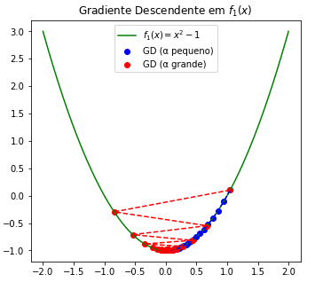
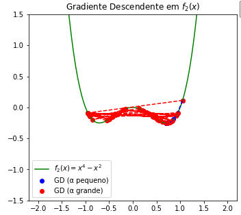
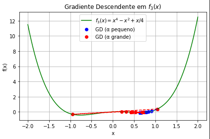
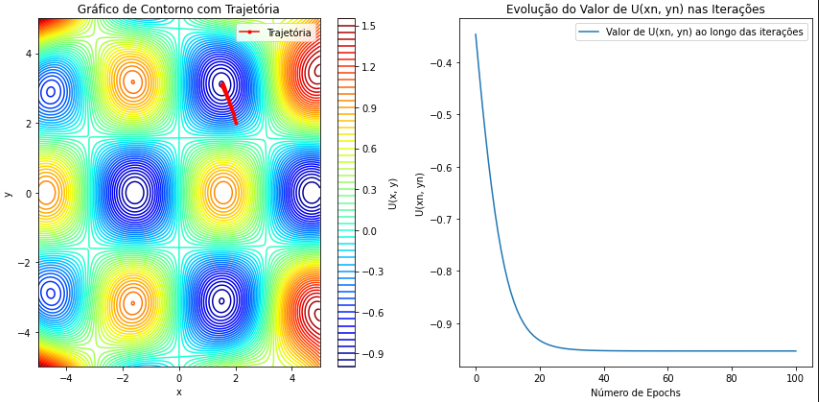

Nesta pasta se encontra a primeira tarefa de Fisica computacional. 

# Algoritmos de Gradiente Descendente

Este projeto contém implementações do algoritmo de **gradiente descendente** para diferentes funções objetivo. O objetivo é visualizar o comportamento do algoritmo com diferentes taxas de aprendizado e configurações iniciais.

---

## 🧮 Exercício 1

Implemente o algoritmo de gradiente descendente para encontrar o mínimo da função:

\[
U(x) = x^2 - 1
\]

- **Taxa de aprendizado**: \(\alpha = 0.1\)  
- **Tolerância**: \(\epsilon = 0.01\)  
- **Máximo de iterações**: 1000  
- **Condição inicial**: \(x_0 = 5\)

📉 **Tarefa**:  
- Ilustre o algoritmo com um gráfico da função \(U(x)\) e a trajetória da partícula.
- Varie os parâmetros \(\alpha\), \(\epsilon\) e \(x_0\) para ver como afetam a convergência.

  **Resultado**: A função é uma parabola com concavidade para cima e o algoritmo sempre converge para o mínimo global desde que alpha não seja excessivamente grande. Uma taxa de aprendizado muito alta pode causar instabilidades, fazendo o ponto ir para o outro extremo da parabola, porém o mínimo é alcançado na maioria dos casos. Na imagem abaixo, temos a implementação do gradiente descendente para encontrar o minimo da função. Nota que os pontos azuis correspondem a passos cujos parametros alpha são pequeno e os vermelhos temos valores de alpha grandes.

 Função usada: `U(x) = x² - 1`  


---

## 🧮 Exercício 2

Repita o exercício 1 para a função:

\[
U(x) = x^2(x - 1)(x + 1)
\]

- **Condição inicial**: \(x_0 = 2\)

📉 **Tarefa**:  
- Ajuste a taxa de aprendizado \(\alpha\) para fazer o algoritmo convergir ora para um mínimo, ora para outro.
- **Reflexão**: O que você conclui sobre a influência de \(\alpha\) na convergência para mínimos diferentes?

  **Resultado**: O gráfico acima ilustra a aplicação do gradiente descendente na função ( f_2(x) = x^4 - x^2 ). A curva verde representa a função a ser minimizada. Observa-se que, para um valor pequeno de alpha (pontos azuis), o algoritmo converge de forma lenta, porém estável, até um mínimo local. Já para valores altos de ( \alpha ) (pontos vermelhos), a trajetória se torna instável, com oscilações e desvios significativos.

Além disso, como a função possui mais de um ponto de mínimo, a posição inicial influencia fortemente o resultado final: dependendo de onde o algoritmo começa, ele pode convergir para diferentes mínimos locais — ou até mesmo não convergir, caso a taxa de aprendizado seja muito alta e cause saltos excessivos.

  

---

## 🧮 Exercício 3

Agora manipule a função anterior somando uma reta:

\[
U(x) = x^2(x - 1)(x + 1) + \frac{x}{4}
\]

📉 **Tarefa**:  
- Repita o processo do exercício 2.
- **Reflexão**: Como a adição de um termo linear afeta a convergência e a escolha da taxa de aprendizado \(\alpha\)? 

  **Resultado**: Ao adicionarmos o termo linear à função, ela deixa de ser simétrica e um dos mínimos torna-se mais profundo — passando a ser o mínimo global. Isso altera significativamente o comportamento do gradiente descendente.

Notamos que, ao variar o valor de alpha, há uma mudança importante na convergência:

Para valores grandes de alpha, os passos são largos e, muitas vezes, a trajetória consegue "saltar" sobre o mínimo local e atingir o mínimo global.
Já com valores pequenos de alpha, os passos são curtos, o que torna o algoritmo mais suscetível a ficar preso no mínimo local mais próximo da posição inicial.
Além disso, o número de passos (iterações) também influencia o resultado final: dependendo do tamanho dos saltos e da inclinação da função ao longo do caminho, o algoritmo pode terminar em diferentes mínimos. Ou seja, tanto a taxa de aprendizado quanto a quantidade de iterações são fatores cruciais para determinar o ponto de convergência.

  

---

## 🧮 Exercício 4

Considere agora uma função bidimensional:

\[
U(\vec{r}) = U(x, y) = \sin(x)\cos(y) + \frac{2(xy)^2}{1000}
\]

A função possui **múltiplos mínimos locais**.

📈 **Visualização**:

1. **Gráfico de contorno**:
   - Use `plt.imshow` ou `plt.pcolormesh` para desenhar a função.
   - Sobreponha a trajetória da partícula no gráfico.

2. **Gráfico de convergência**:
   - Plote o valor de \(U(x_n, y_n)\) em cada iteração \(n\) (semelhante a "epochs" em redes neurais).

🔁 **Parâmetros para explorar**:
- Condições iniciais: \((x_0, y_0)\)
- Taxa de aprendizado \(\alpha\)

💬 **Reflexões**:
- O que acontece ao aumentar/diminuir muito \(\alpha\)?
- Você consegue atingir o **mínimo global**?

   **Resultado**:  Gráfico de Contorno com Trajetória (à esquerda)
Este gráfico mostra as curvas de nível da função ( U(x, y) ), representando seu relevo.
A linha vermelha indica a trajetória percorrida pelo algoritmo de gradiente descendente a partir do ponto inicial.
Se a trajetória for suave e converge para um ponto estável, isso indica que o algoritmo está funcionando corretamente e aproximando-se de um mínimo da função.

Gráfico da Evolução de ( U(x_n, y_n) ) (à direita)
Este gráfico mostra como o valor da função ( U ) varia ao longo das iterações.
Uma curva decrescente e que se estabiliza sugere que o algoritmo está convergindo para um mínimo.
Oscilações ou estagnação precoce podem indicar que a taxa de aprendizado está inadequada ou que o ponto inicial levou a um mínimo local raso.

 


---

## 📦 Requisitos

- Python 3
- Bibliotecas: `numpy`, `matplotlib`

Instale com:

```bash
pip install numpy matplotlib
